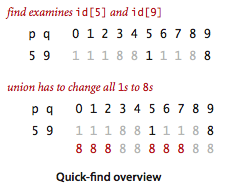
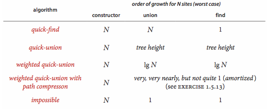

# 1.5 Union Find

__Dynamic connectivity.__ The input is a sequence of pairs of integers, where each integer represents an object of some type and we are to interpret the pair p q as meaning p is connected to q. We assume that "is connected to" is an _equivalence relation_:

- _symmetric_: If p is connected to q, then q is connected to p.
- _transitive_: If p is connected to q and q is connected to r, then p is connected to r.
- _reflexive_: p is connected to p.

An equivalence relation partitions the objects into equivalence classes or connected components.

Our goal is to write a program to filter out extraneous pairs from the sequence: When the program reads a pair p q from the input, it should write the pair to the output only if the pairs it has seen to that point do not imply that p is connected to q. If the previous pairs do imply that p is connected to q, then the program should ignore the pair p q and proceed to read in the next pair.


__Union-Find API.__ The following API encapsulates the basic operations that we need.

```
class UF:
    # initialize N sites with integer names (0 to N-1)
    def __init__(self, N):

    # add connection between p and q
    def union(self, p, q):

    # component identifier for p (0 to N-1)
    def find(self, p):

    # return true if p and q are in the same component
    def connected(self, p, q):

    # returns the number of components
    def count(self):
```

To test the utility of the API, the main() in [uf.py](uf.py) solves the dynamic connectivity problem. We also prepare test data: the file [tinyUF.txt](tinyUF.txt) contains the 11 connections used in our small example, the file [mediumUF.txt](mediumUF.txt) contains 900 connections, and the file [largeUF.txt](largeUF.txt) is an example with millions of connections.

__Implementations.__ We now consider several different implementations, all based on using a site-indexed array __id[]__ to determine whether two sites are in the same component.

- _Quick-find._ [quick_find_uf.py](quick_find_uf.py) maintains the invariant that p and q are connected if and only if __id[p]__ is equal to __id[q]__. In other words, all sites in a component must have the same value in __id[]__.



- _Quick-union._ QuickUnionUF.java is based on the same data structure—the site-indexed __id[]__ array—but it uses a different interpretation of the values that leads to more complicated structures. Specifically, the __id[]__ entry for each site will be the name of another site in the same component (possibly itself). To implement __find()__ we start at the given site, follow its link to another site, follow that sites link to yet another site, and so forth, following links until reaching a root, a site that has a link to itself. Two sites are in the same component if and only if this process leads them to the same root. To validate this process, we need __union()__ to maintain this invariant, which is easily arranged: we follow links to find the roots associated with each of the given sites, then rename one of the components by linking one of these roots to the other.


- _Weighted quick-union._ Rather than arbitrarily connecting the second tree to the first for __union()__ in the quick-union algorithm, we keep track of the size of each tree and always connect the smaller tree to the larger. Program [weighted_quick_union_uf.py](weighted_quick_union_uf.py) implements this approach.


- _Weighted quick-union with path compression._ There are a number of easy ways to improve the weighted quick-union algorithm further. Ideally, we would like every node to link directly to the root of its tree, but we do not want to pay the price of changing a large number of links. We can approach the ideal simply by making all the nodes that we do examine directly link to the root.

- __Union-find cost model.__ When studying algorithms for union-find, we count the number of _array_ accesses (number of times an array entry is accessed, for read or write).

- __Definitions.__ The _size_ of a tree is its number of nodes. The _depth_ of a node in a tree is the number of links on the path from it to the root. The _height_ of a tree is the maximum depth among its nodes.

- __Proposition.__ The quick-find algorithm uses one array access for each call to __find()__ and between N+3 and 2N+1 array accesses for each call to __union()__ that combines two components.

- __Proposition.__ The number of array accesses used by __find()__ in quick-union is 1 plus twice the depth of the node corresponding to the given site. The number of array accesses used by __union()__ and __connected()__ is the cost of the two __find()__ operations (plus 1 for __union()__ if the given sites are in different trees).

- __Proposition.__ The depth of any node in a forest built by weighted quick-union for N sites is at most lg N.

- __Corollary.__ For weighted quick-union with N sites, the worst-case order of growth of the cost of __find()__, __connected()__, and __union()__ is log N.




## Review Exercises

1. See [Percolation assignment](../../6_practice/5_percolation)
2. __True or false.__ In the quick union implementation, suppose we set `id[p]`to `id[root(q)]` instead of setting `id[root(p)]` Would the resulting algorithm be correct?
3. Which of the following arrays could not possibly occur during the execution of weighted quick union with path compression:
```
(a) 0 1 2 3 4 5 6 7 8 9
(b) 7 3 8 3 4 5 6 8 8 1
(c) 6 3 8 0 4 5 6 9 8 1
(d) 0 0 0 0 0 0 0 0 0 0
(e) 9 6 2 6 1 4 5 8 8 9
(f) 9 8 7 6 5 4 3 2 1 0
```
