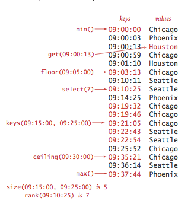

# 3.1 Symbol Tables

__Symbol table.__ The primary purpose of a _symbol table_ is to associate a value with a key. The client can _insert_ key–value pairs into the symbol table with the expectation of later being able to _search_ for the value associated with a given key.


API. Here is the API

```
class ST:
    # create an empty symbol table
    def __init__(self):

    # put a key-value pair into the table. Remove key from table if value is None
    def put(self, key, value):

    # returns value paired with key. Returns None if key is absent
    def get(self, key):

    # removes key and its value from the symbol table
    def delete(self, key):

    # Returns a boolean indicating if there is a value paired with the key.
    def contains(self, key):

    # Returns a boolean indicating if the table is empty
    def isEmpty(self):

    # returns a list of all keys in the table
    def keys(self):
```


We consider several design choices for our implementations to make our code consistent, compact, and useful.

- _Generics._ We consider the methods without specifying the types of keys and values being processed. Since Python does not have strong typing this is quite easy.
- _Duplicate keys._ Only one value is associated with each key (no duplicate keys in a table). When a client puts a key-value pair into a table already containing that key (and an associated value), the new value replaces the old one. These conventions define the associative _array abstraction_, where you can think of a symbol table as being just like an array, where keys are indices and values are array entries.
- _Null values._ No key can be associated with the value null. This convention is directly tied to our specification in the API that __get()__ should return null for keys not in the table. This convention has two (intended) consequences: First, we can test whether or not the symbol table defines a value associated with a given key by testing whether __get()__ returns null. Second, we can use the operation of calling __put()__ with null as its second (value) argument to implement deletion.
- _Deletion._ Deletion in symbol tables generally involves one of two strategies: lazy deletion, where we associate keys in the table with null, then perhaps remove all such keys at some later time, and eager deletion, where we remove the key from the table immediately. As just discussed, the code __put(key, null)__ is an easy (lazy) implementation of __delete(key)__. When we give an (eager) implementation of __delete()__, it is intended to replace this default.
- _Iterators._ The __keys()__ method returns a list of all the keys for clients to use to iterate through the keys.
- _Consistency._ A best practice is to make Key types immutable, because consistency cannot otherwise be guaranteed.

__Ordered symbol tables.__ In typical applications, keys are Comparable objects, so the option exists of using the code __a.compareTo(b)__ to compare two keys a and b. Several symbol-table implementations take advantage of order among the keys that is implied by Comparable to provide efficient implementations of the __put()__ and __get()__ operations. More important, in such implementations, we can think of the symbol table as keeping the keys in order and consider a significantly expanded API that defines numerous natural and useful operations involving relative key order. For applications where keys are Comparable, we implement the following API:

```
class ST:
    # create an empty symbol table
    def __init__(self):

    # put a key-value pair into the table. Remove key from table if value is None
    def put(self, key, value):

    # returns value paired with key. Returns None if key is absent
    def get(self, key):

    # removes key and its value from the symbol table
    def delete(self, key):

    # Returns a boolean indicating if there is a value paired with the key.
    def contains(self, key):

    # Returns a boolean indicating if the table is empty
    def isEmpty(self):

    # returns a list of all keys in the table between lo and hi
    def keys(self, lo = None, hi = None):

    # returns the number of key value pairs
    # returns the number of keys between lo and hi where lo,hi are keys
    def size(self, lo = None, hi = None):

    # returns the smallest key
    def min(self):

    # returns the largest key
    def max(self):

    # returns the largest key less than or equal to key
    def floor(self, key):

    # returns the smallest key larger than or equal to key
    def celing(self, key):

    # returns the number of keys less than key
    def rank(self, key):

    # returns the key that has rank k
    def select(self, key):

    # deletes the smallest key
    def delete_min(self):

    # deletes the largest key
    def delete_max(self):
```



- _Minimum and maximum._ Perhaps the most natural queries for a set of ordered keys are to ask for the smallest and largest keys. We have already encountered the need for these operations (in our discussion of priority queues in Section 3.4).
- _Floor and ceiling._ Given a key, it is often useful to be able to perform the floor operation (find the largest key that is less than or equal to the given key) and the ceiling operation (find the smallest key that is greater than or equal to the given key). The nomenclature comes from functions defined on real numbers (the floor of a real number x is the largest integer that is smaller than or equal to x and the ceiling of a real number x is the smallest integer that is greater than or equal to x).
- _Rank and selection._ The basic operations for determining where a new key fits in the order are the rank operation (find the number of keys less than a given key) and the select operation (find the key with a given rank). We also have already encountered the need for these operations, in our discussion of sort applications in Section 2.5.
- _Range queries._ How many keys fall within a given range? Which keys fall in a given range? The two-argument size() and keys() methods that answer these questions are useful in many applications, particularly in large databases.
Delete minimum and delete maximum. Our ordered symbol table API adds to the basic API methods to delete the maximum and minimum keys (and their associated values).
- _Exceptional cases._ When a method is to return a key and there is no key fitting the description in the table, our convention is to throw an exception.
- _Key equality (revisited)._ The best practice is to make __compareTo()__ consistent with __==__ in all Comparable types. That is, for every pair of objects a and b in any give Comparable type, it should be the case that __(a.compareTo(b) == 0)__ and __a.equals(b)__ have the same value.


__Sample clients.__ We consider two clients: a test client that we use to trace algorithm behavior on small inputs and a performance client.
- _Test client._ The __main()__ client in each of our symbol table implementations reads in a sequence of strings from standard input, builds a symbol table by associating the value i with the ith key in the input, and then prints the table.

__Sequential search in an unordered linked list.__ Program [sequential_search_st.py](sequential_search_st.py) implements a symbol table with a linked list of nodes that contain keys and values. To implement __get()__, we scan through the list, using __==__ to compare the search key with the key in each node in the list. If we find the match, we return the associated value; if not, we return null. To implement __put()__, we also scan through the list, using __==__ to compare the client key with the key in each node in the list. If we find the match, we update the value associated with that key to be the value given in the second argument; if not, we create a new node with the given key and value and insert it at the beginning of the list. This method is known as sequential search.


__Proposition A.__ Unsuccessful search and insert in an (unordered) linked-list symbol table both use N compares, and successful search uses N compares in the worst case. In particular, inserting N keys into an initially empty linked-list symbol table uses ~N<sup>2</sup>/2 compares.

__Binary search in an ordered array.__ Program [binary_search_st.py](binary_search_st.py) implements the ordered symbol table API. The underlying data structure is two parallel array, with the keys kept in order. The heart of the implementation is the __rank()__ method, which returns the number of keys smaller than a given key. For __get()__, the rank tells us precisely where the key is to be found if it is in the table (and, if it is not there, that it is not in the table). For __put()__, the rank tells us precisely where to update the value when the key is in the table, and precisely where to put the key when the key is not in the table. We move all larger keys over one position to make room (working from back to front) and insert the given key and value into the proper positions in their respective arrays.


- _Binary search._ The reason that we keep keys in an ordered array is so that we can use array indexing to dramatically reduce the number of compares required for each search, using a venerable classic algorithm known as binary search. The basic idea is simple: we maintain indices into the sorted key array that delimit the subarray that might contain the search key. To search, we compare the search key against the key in the middle of the subarray. If the search key is less than the key in the middle, we search in the left half of the subarray; if the search key is greater than the key in the middle we search in the right half of the subarray; otherwise the key in the middle is equal to the search key.


- _Other operations._ Since the keys are kept in an ordered array, most of the order-based operations are compact and straightforward.

__Proposition B.__ Binary search in an ordered array with N keys uses no more than lg N + 1 compares for a search (successful or unsuccessful) in the worst case.

__Proposition C.__ Inserting a new key into an ordered array uses ~ 2N array accesses in the worst case, so inserting N keys into an initially empty table uses ~ N<sup>2</sup> array accesses in the worst case.

# Review Exercises

1. __Student data type.__ Write a data type `student.py` that implements a student with a name and section. Include an `equals()` method.
