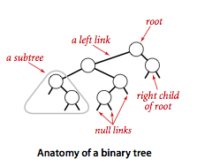
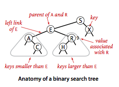
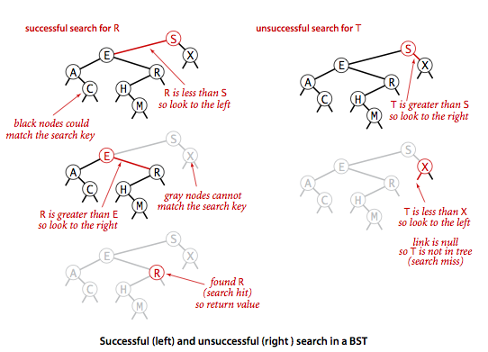
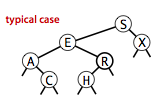

# 3.2 Binary Search Trees

We examine a symbol-table implementation that combines the flexibility of insertion in linked lists with the efficiency of search in an ordered array. Specifically, using two links per node leads to an efficient symbol-table implementation based on the binary search tree data structure, which qualifies as one of the most fundamental algorithms in computer science.

__Definition.__ A _binary search tree_ (BST) is a binary tree where each node has a Comparable key (and an associated value) and satisfies the restriction that the key in any node is larger than the keys in all nodes in that node's left subtree and smaller than the keys in all nodes in that node's right subtree.






__Basic implementation.__ Program [bst.py](bst.py) implements the ordered symbol-table API using a binary search tree. We define a inner private class to define nodes in BST. Each node contains a key, a value, a left link, a right link, and a node count. The left link points to a BST for items with smaller keys, and the right link points to a BST for items with larger keys. The instance variable N gives the node count in the subtree rooted at the node. This field facilitates the implementation of various ordered symbol-table operations, as you will see


- _Search._ A recursive algorithm to search for a key in a BST follows immediately from the recursive structure: If the tree is empty, we have a search miss; if the search key is equal to the key at the root, we have a search hit. Otherwise, we search (recursively) in the appropriate subtree. The recursive __get()__ method implements this algorithm directly. It takes a node (root of a subtree) as first argument and a key as second argument, starting with the root of the tree and the search key



- _Insert._ Insert is not much more difficult to implement than search. Indeed, a search for a key not in the tree ends at a null link, and all that we need to do is replace that link with a new node containing the key. The recursive __put()__ method accomplishes this task using logic similar to that we used for the recursive search: If the tree is empty, we return a new node containing the key and value; if the search key is less than the key at the root, we set the left link to the result of inserting the key into the left subtree; otherwise, we set the right link to the result of inserting the key into the right subtree.


__Analysis.__The running times of algorithms on binary search trees depend on the shapes of the trees, which, in turn, depends on the order in which keys are inserted.





It is reasonable, for many applications, to use the following simple model: We assume that the keys are (uniformly) random, or, equivalently, that they are inserted in random order.

__Proposition.__ Search hits in a BST built from N random keys requires ~ 2 ln N (about 1.39 lg N) compares on the average.

__Proposition.__ Insertion and search misses in a BST built from N random keys requires ~ 2 ln N (about 1.39 lg N) compares on the average.

__Order-based methods and deletion.__ An important reason that BSTs are widely used is that they allow us to keep the keys _in order_. As such, they can serve as the basis for implementing the numerous methods in our ordered symbol-table API.

- _Minimum and maximum._ If the left link of the root is null, the smallest key in a BST is the key at the root; if the left link is not null, the smallest key in the BST is the smallest key in the subtree rooted at the node referenced by the left link. Finding the maximum key is similar, moving to the right instead of to the left.
- _Floor and ceiling._ If a given key key is less than the key at the root of a BST, then the floor of key (the largest key in the BST less than or equal to key) must be in the left subtree. If key is greater than the key at the root, then the floor of key could be in the right subtree, but only if there is a key smaller than or equal to key in the right subtree; if not (or if key is equal to the key at the root) then the key at the root is the floor of key. Finding the ceiling is similar, interchanging right and left.
- _Selection._ Suppose that we seek the key of rank k (the key such that precisely _k_ other keys in the BST are smaller). If the number of keys t in the left subtree is larger than k, we look (recursively) for the key of rank k in the left subtree; if t is equal to k, we return the key at the root; and if t is smaller than k, we look (recursively) for the key of rank _k - t - 1_ in the right subtree.


- _Rank._ If the given key is equal to the key at the root, we return the number of keys t in the left subtree; if the given key is less than the key at the root, we return the rank of the key in the left subtree; and if the given key is larger than the key at the root, we return t plus one (to count the key at the root) plus the rank of the key in the right subtree.
- _Delete the minimum and maximum._ For delete the minimum, we go left until finding a node that that has a null left link and then replace the link to that node by its right link. The symmetric method works for delete the maximum.
-_Delete._ We can proceed in a similar manner to delete any node that has one child (or no children), but what can we do to delete a node that has two children? We are left with two links, but have a place in the parent node for only one of them. An answer to this dilemma, first proposed by T. Hibbard in 1962, is to delete a node __x__ by replacing it with its successor. Because x has a right child, its successor is the node with the smallest key in its right subtree. The replacement preserves order in the tree because there are no keys between __x.key__ and the successor's key. We accomplish the task of replacing x by its successor in four (!) easy steps:
    - Save a link to the node to be deleted in __t__
    - Set __x__ to point to its successor __min(t.right)__.
    - Set the right link of x (which is supposed to point to the BST containing all the keys larger than __x.key__) to __deleteMin(t.right)__, the link to the BST containing all the keys that are larger than __x.key__ after the deletion.
    - Set the left link of __x__ (which was null) to __t.left__ (all the keys that are less than both the deleted key and its successor).


While this method does the job, it has a flaw that might cause performance problems in some practical situations. The problem is that the choice of using the successor is arbitrary and not symmetric. Why not use the predecessor?

- _Range search._ To implement the __keys()__ method that returns the keys in a given range, we begin with a basic recursive BST traversal method, known as inorder traversal. To illustrate the method, we consider the task of printing all the keys in a BST in order. To do so, print all the keys in the left subtree (which are less than the key at the root by definition of BSTs), then print the key at the root, then print all the keys in the right subtree, (which are greater than the key at the root by definition of BSTs).
```
def _print_node(self, x):
    if x is None:
        return None
    self._print_node(x.left)
    print(x.key)
    self._print_node(x.right)
```
To implement the two-argument __keys()__ method, we modify this code to add each key that is in the range to a __Queue__, and to skip the recursive calls for subtrees that cannot contain keys in the range.

__Proposition.__ Search, insertion, finding the minimum, finding the maximum, floor, ceiling, rank, select, delete the minimum, delete the maximum, delete, and range count operations all take time proportional to the height of the tree, in the worst case.

# Review Exercises

1.  Give five orderings of the keys `A X C S E R H` that, when inserted into an initially empty BST, produce the best-case tree.
2.  Give nonrecursive implementations of `get()`, `put()`, and `keys()` for BST.
3.  Certification. Write a method `isBST()` in [bst.py](bst.py) that takes a `Node` as argument and returns `true` if the argument node is the root of a binary search tree, `false` otherwise.
4.  __BST reconstruction.__ Given the preorder traversal of a BST (not including null nodes), reconstruct the tree.
5.  __Tree traversal with constant extra memory.__ Describe how to perform an inorder tree traversal with constant extra memory (e.g., no function call stack). Hint: on the way down the tree, make the child node point back to the parent (and reverse it on the way up the tree).
6. __Reverse a BST.__ Given a standard BST (where each key is greater than the keys in its left subtree and smaller than the keys in its right subtree), design a linear-time algorithm to transform it into a reverese BST (where each key is smaller than the keys in its left subtree and greater than the keys in its right subtree). The resulting tree shape should be symmetric to the original one.
7. __Level-order traversal reconstruction of a BST.__ Given a sequence of keys, design a linear-time algorithm to determine whether it is the level-order traversal of some BST (and construct the BST itself).
8. __Find two swapped keys in a BST.__ Given a BST in which two keys in two nodes have been swapped, find the two keys.


