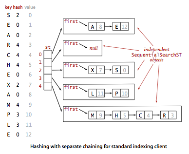

# 3.4 Hash Tables

If keys are small integers, we can use an array to implement a symbol table, by interpreting the key as an array index so that we can store the value associated with key i in array position i. In this section, we consider hashing, an extension of this simple method that handles more complicated types of keys. We reference key-value pairs using arrays by doing arithmetic operations to transform keys into array indices.


Search algorithms that use hashing consist of two separate parts. The first step is to compute a _hash function_ that transforms the search key into an array index. Ideally, different keys would map to different indices. This ideal is generally beyond our reach, so we have to face the possibility that two or more different keys may hash to the same array index. Thus, the second part of a hashing search is a collision-resolution process that deals with this situation.


__Hash functions.__ If we have an array that can hold M key-value pairs, then we need a function that can transform any given key into an index into that array: an integer in the range [0, M-1]. We seek a hash function that is both easy to compute and uniformly distributes the keys.

- _Typical example._ Suppose that we have an application where the keys are U.S. social security numbers. A social security number such as 123-45-6789 is a 9-digit number divided into three fields. The first field identifies the geographical area where the number was issued (for example number whose first field are 035 are from Rhode Island and numbers whose first field are 214 are from Maryland) and the other two fields identify the individual. There are a billion different social security numbers, but suppose that our application will need to process just a few hundred keys, so that we could use a hash table of size M = 1000. One possible approach to implementing a hash function is to use three digits from the key. Using three digits from the field on the right is likely to be preferable to using the three digits in the field on the left (since customers may not be equally dispersed over geographic areas), but a better approach is to use all nine digits to make an int value, then consider hash functions for integers, described next.
- _Positive integers._ The most commonly used method for hashing integers is called modular hashing: we choose the array size M to be prime, and, for any positive integer key k, compute the remainder when dividing k by M. This function is very easy to compute (k % M, in Java), and is effective in dispersing the keys evenly between 0 and M-1.
- _Floating-point numbers._ If the keys are real numbers between 0 and 1, we might just multiply by M and round off to the nearest integer to get an index between 0 and M-1. Although it is intuitive, this approach is defective because it gives more weight to the most significant bits of the keys; the least significant bits play no role. One way to address this situation is to use modular hashing on the binary representation of the key (this is what Java does).
- _Strings._ Modular hashing works for long keys such as strings, too: we simply treat them as huge integers. For example, the code below computes a modular hash function for a String s, where R is a small prime integer. Here M is a large prime number.
```
def hash_string(s):
    hash = 0
    for i in range(0, len(s)):
        hash = (R * hash + ord(s[i]])) % M
```


We have three primary requirements in implementing a good hash function for a given data type:
- It should be _deterministic_—equal keys must produce the same hash value.
- It should be _efficient_ to compute.
- It should _uniformly distribute_ the keys.
- 
To analyze our hashing algorithms and develop hypotheses about their performance, we make the following idealized assumption.

__Assumption J__ (uniform hashing assumption). The hash function that we use uniformly distributes keys among the integer values between 0 and M-1.

__Hashing with separate chaining.__ A hash function converts keys into array indices. The second component of a hashing algorithm is collision resolution: a strategy for handling the case when two or more keys to be inserted hash to the same index. A straightforward approach to collision resolution is to build, for each of the M array indices, a linked list of the key-value pairs whose keys hash to that index. The basic idea is to choose M to be sufficiently large that the lists are sufficiently short to enable efficient search through a two-step process: hash to find the list that could contain the key, then sequentially search through that list for the key.



Program [separate_chaining_hash_st.py](separate_chaining_hash_st.py) implements a symbol table with a separate-chaining hash table. It maintains an array of [sequential_search_st.py](sequential_search_st.py) objects and implements __get()__ and __put()__ by computing a hash function to choose which SequentialSearchST can contain the key and then using __get()__ and __put()__ from SequentialSearchST to complete either job. Program [separate_chaining_lite_hash_st.py] is similar but does it using an explict __Node__ nested class.

__Proposition K.__ In a separate-chaining hash table with M lists and N keys, the probability (under Assumption J) that the number of keys in a list is within a small constant factor of N/M is extremely close to 1. of N/M is extremely close to 1. (Assumes an idealistic hash function.)

This classical mathematical result is compelling, but it completely depends on Assumption J. Still, in practice, the same behavior occurs.

__Property L.__ In a separate-chaining hash table with M lists and N keys, the number of compares (equality tests) for search and insert is proportional to N/M.

__Hashing with linear probing.__ Another approach to implementing hashing is to store N key-value pairs in a hash table of size M > N, relying on empty entries in the table to help with with collision resolution. Such methods are called open-addressing hashing methods. The simplest open-addressing method is called linear probing: when there is a collision (when we hash to a table index that is already occupied with a key different from the search key), then we just check the next entry in the table (by incrementing the index). There are three possible outcomes:
- key equal to search key: search hit
- empty position (null key at indexed position): search miss
- key not equal to search key: try next entry


Program [linear_probing_hash_st.py](linear_probing_hash_st.py) is an implementation of the symbol-table ADT using this method.

As with separate chaining, the performance of open-addressing methods is dependent on the ratio α = N/M, but we interpret it differently. For separate chaining α is the average number of items per list and is generally larger than 1. For open addressing, α is the percentage of table positions that are occupied; it must be less than 1. We refer to α as the load factor of the hash table.

__Proposition M.__ In a linear-probing has table of size M with N = α M keys, the average number of probes (under Assumption J) is ~ 1/2 (1 + 1 / (1 - α)) for search hits and ~ 1/2 (1 + 1 / (1 - α)^2) for search misses or inserts.

# Review Exercises
1. Is the following implementation of `hashCode()` legal?
```
def hashCode():
   return 17
```
Solution. Yes, but it would cause all keys to hash to the same spot, which would lead to poor performance.
2. Suppose we wish to repeatedly search a linked list of length N elements, each of which contains a very long string key. How might we take advantage of the hash value when searching the list for an element with a given key? 
3. Implement `hashCode()` and `equals()` for the following data type. Be careful since it is likely that many of the points will have small integers for x and y.
```
class Point2D:
    def self__init(self, x, y):
```
4. __Password checker.__ Write a program that reads in a string from the command line and a dictionary of words from standard input, and checks whether it is a "good" password. Here, assume "good" means that it (i) is at least 8 characters long, (ii) is not a word in the dictionary, (iii) is not a word in the dictionary followed by a digit 0-9 (e.g., hello5), (iv) is not two words separated by a digit (e.g., hello2world)