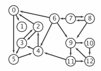
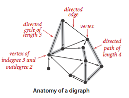
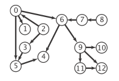
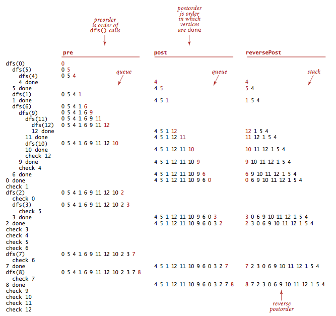

# 4.2 Directed Graphs


__Digraphs.__ A _directed graph_ (or _digraph_) is a set of vertices and a collection of _directed edges_ that each connects an ordered pair of vertices. We say that a directed edge _points from_ the first vertex in the pair and points to the second vertex in the pair. We use the names 0 through V-1 for the vertices in a V-vertex graph.



__Glossary.__ Here are some definitions that we use.

- A _self-loop_ is an edge that connects a vertex to itself.
- Two edges are _parallel_ if they connect the same ordered pair of vertices.
- The _outdegree_ of a vertex is the number of edges pointing from it. 
- The _indegree_ of a vertex is the number of edges pointing to it.
- A _subgraph_ is a subset of a digraph's edges (and associated vertices) that constitutes a digraph.
- A _directed path_ in a digraph is a sequence of vertices in which there is a (directed) edge pointing from each vertex in the sequence to its successor in the sequence. A _simple path_ is one with no repeated vertices.
- A _directed cycle_ is a directed path (with at least one edge) whose first and last vertices are the same. A _simple cycle_ is a cycle with no repeated edges or vertices (except the requisite repetition of the first and last vertices).
- The _length_ of a path or a cycle is its number of edges.
- We say that a vertex __w__ is _reachable_ from a vertex __v__ if there exists a directed path from v to w.
- We say that two vertices __v__ and __w__ are _strongly connected_ if they are mutually reachable: there is a directed path from v to w and a directed path from w to v.
- A digraph is _strongly connected_ if there is a directed path from every vertex to every other vertex.
- A digraph that is not strongly connected consists of a set of _strongly-connected components_, which are maximal strongly-connected subgraphs.
- A _directed acyclic graph_ (or DAG) is a digraph with no directed cycles.




__Digraph graph data type.__ We implement the following digraph API.

```
class Digraph:
    # create a V-vertex digraph with no edges
    def __init__(self, V):
    # returns number of vertices in this Digraph
    def V(self):
    # returns number of edges in this Digraph
    def E(self):
    # add edge v->w to this Digraph
    def add_edge(self, v,w):
    # returns neighbors of v as a list
    def adj(self, v):
    # returns a Digraph that is the reverse of this Digraph
    def reverse(self):
```


The key method __adj()__ allows client code to iterate through the vertices adjacent from a given vertex.

Below is an example of contructing a Digraph with some arbitrary input.


__Graph representation.__ We use the adjacency-lists representation, where we maintain a vertex-indexed array of lists of the vertices connected by an edge to each vertex.


[digraph.py](digraph.py) implements this API using the adjacency-matrix representation.

__Reachability in digraphs.__ Depth-first search and breadth-first search are fundamentally digraph-processing algorithms.

- _Single-source reachability:_ Given a digraph and source __s__, is there a directed path from __s__ to __v__? If so, find such a path. [directed_dfs.py](directed_dfs.py) uses depth-first search to solve this problem.
- _Multiple-source reachability:_ Given a digraph and a set of source vertices, is there a directed path from any vertex in the set to __v__? [directed_dfs](directed_dfs.py) uses depth-first search to solve this problem.
- _Single-source directed paths:_ given a digraph and source __s__, is there a directed path from __s__ to __v__? If so, find such a path. [directed_dfs_paths.py](directed_dfs_paths.py) uses depth-first search to solve this problem.
- _Single-source shortest directed paths:_ given a digraph and source __s__, is there a directed path from __s__ to __v__? If so, find a shortest such path. [directed_bfs_paths.py](directed_bfs_paths.py) uses breadth-first search to solve this problem.

__Cycles and DAGs.__ Directed cycles are of particular importance in applications that involve processing digraphs.



- _Directed cycle detection:_ does a given digraph have a directed cycle? If so, find such a cycle. One can solve this problem using a modified depth-first search but begin the source vertex unmarked.
- _Depth-first orders:_ Depth-first search search visits each vertex exactly once. Three vertex orderings are of interest in typical applications:
    - _Preorder:_ Put the vertex on a queue before the recursive calls.
    - _Postorder:_ Put the vertex on a queue after the recursive calls.
    - _Reverse postorder:_ Put the vertex on a stack after the recursive calls.
[depth_first_order.py](depth_first_order.py) computes these orders.



- _Topological sort:_ given a digraph, put the vertices in order such that all its directed edges point from a vertex earlier in the order to a vertex later in the order (or report that doing so is not possible). One can solve this problem using depth-first search. Remarkably, a reverse postorder in a DAG provides a topological order.


__Proposition.__ A digraph has a topological order if and only if it is a DAG.
__Proposition.__ Reverse postorder in a DAG is a topological sort.
__Proposition.__ With depth-first search, we can topologically sort a DAG in time proportional to V + E.
__Strong connectivity.__ Strong connectivity is an equivalence relation on the set of vertices:

- _Reflexive:_ Every vertex v is strongly connected to itself.
- _Symmetric:_ If v is strongly connected to w, then w is strongly connected to v.
- _Transitive:_ If v is strongly connected to w and w is strongly connected to x, then v is also strongly connected to x.

Strong connectivity partitions the vertices into equivalence classes, which we refer to as _strong components_ for short. We seek to implement the following API:

```
class SCC:
    # contructor takes in Digraph G as argument
    def __init__(self, G):
    # returns a boolean indicating if vertices v,w are strongly connected
    def strongly_connected(self, v, w):
    # returns the number of strong components
    def count(self):
```

Remarkably, [kosaraju_sharir_scc.py](kosaraju_sharir_scc.py) implements the API with just a few lines of code added to [cc.py](../1_undirected_graphs/cc.py), as follows:

- Given a digraph G, use [depth_first_order.py](depth_first_order.py) to compute the reverse postorder of its reverse, G<sup>R</sup>.
- Run standard DFS on G, but consider the unmarked vertices in the order just computed instead of the standard numerical order.
- All vertices reached on a call to the recursive __dfs()__ from the constructor are in a strong component (!), so identify them as in CC.

__Proposition.__ The Kosaraju-Sharir algorithm uses preprocessing time and space proportional to V + E to support constant-time strong connectivity queries in a digraph.

# Review Exercises 
1. Create a copy constructor for [digraph.py](digraph.py) that takes as input a digraph G and creates and initializes a new copy of the digraph. Any changes a client makes to G should not affect the newly created digraph.
2. What are the strong components of a DAG?
3. True or false: The reverse postorder of a digraph's reverse is the same as the postorder of the digraph.
4. True or false: If we modify the Kosaraju-Sharir algorithm to run the first depth-first search in the digraph G (instead of the reverse digraph G^R) and the second depth-first search in G^R (instead of G), then it will still find the strong components.
5. True or false: If we modify the Kosaraju-Sharir algorithm to replace the second depth-first search with breadth-first search, then it will still find the strong components.
6. __Shortest directed cycle.__ Given a digraph, design an algorithm to find a directed cycle with the minimum number of edges (or report that the graph is acyclic). The running time of your algorithm should be proportional to E V in the worst case. Application: give a set of patients in need of kidney transplants, where each patient has a family member willing to donate a kidney, but of the wrong type. Willing to donate to another person provided their family member gets a kidney. Then hospital performs a "domino surgery" where all transplants are done simultaneously.
7. __Odd-length directed cycle.__ Design a linear-time algorithm to determine whether a digraph has an odd-length directed cycle.
8. __Reachable vertex in a DAG.__ Design a linear-time algorithm to determine whether a DAG has a vertex that is reachable from every other vertex.
9. __Nine-letter word.__ Find a nine-letter English word such that remains an English word after successively removing each of its letters (in an appropriate order). Build a digraph with words and vertices and an edge from one word to another if it can be formed by adding one letter.
10. __Reverse postorder vs. preorder.__ True or false: The reverse postorder of a digraph is the same as the preorder of the digraph.