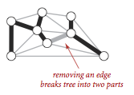
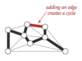
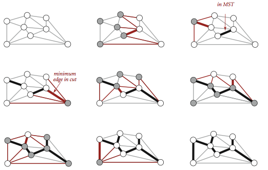
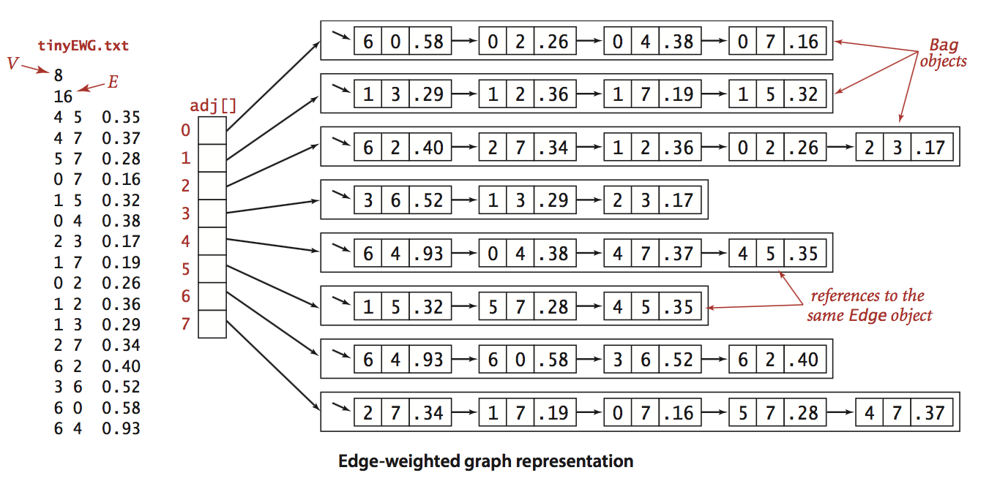

# 4.3 Minimum Spannign Trees

__Minimum spanning tree.__ An _edge-weighted graph_ is a graph where we associate weights or costs with each edge. A _minimum spanning tree (MST)_ of an edge-weighted graph is a spanning tree whose weight (the sum of the weights of its edges) is no larger than the weight of any other spanning tree.


__Assumptions.__ To streamline the presentation, we adopt the following conventions:
- _The graph is connected._ The spanning-tree condition in our definition implies that the graph must be connected for an MST to exist. If a graph is not connected, we can adapt our algorithms to compute the MSTs of each of its connected components, collectively known as a _minimum spanning forest_.
- _The edge weights are not necessarily distances._ Geometric intuition is sometimes beneficial, but the edge weights can be arbitrary.
- _The edge weights may be zero or negative._ If the edge weights are all positive, it suffices to define the MST as the subgraph with minimal total weight that connects all the vertices.
- _The edge weights are all different._ If edges can have equal weights, the minimum spanning tree may not be unique. Making this assumption simplifies some of our proofs, but all of our our algorithms work properly even in the presence of equal weights.

__Underlying principles.__ We recall two of the defining properties of a tree:
-Adding an edge that connects two vertices in a tree creates a unique cycle.
-Removing an edge from a tree breaks it into two separate subtrees.





A __cut__ of a graph is a partition of its vertices into two disjoint sets. A __crossing edge__ is an edge that connects a vertex in one set with a vertex in the other. We recall For simplicity, we assume all edge weights are distinct. Under this assumption, the MST is unique. Define cut and cycle. The following properties lead to a number of MST algorithms.


__Proposition. (Cut property)__ Given any cut in an edge-weighted graph (with all edge weights distinct), the crossing edge of minimum weight is in the MST of the graph.


The cut property is the basis for the algorithms that we consider for the MST problem. Specifically, they are special cases of the __greedy algorithm__.

__Proposition. (Greedy MST algorithm)__ The following method colors black all edges in the the MST of any connected edge-weighted graph with V vertices: Starting with all edges colored gray, find a cut with no black edges, color its minimum-weight edge black, and continue until V-1 edges have been colored black.



__Edge-weighted graph data type.__ We represent the weighted edges using the following API:

```
class Edge:
    # initializes an edge between vertices v and w with a certain edge-weight
    def __init__(self, v, w, weight):

    # returns the weight of this edge
    def weight(self):

    # returns either vertex in this edge
    def either(self):

    # returns the other vertex in this edge
    def other(self, v):

    # compares to another edge's weight
    def __cmp__(self, other_edge):
```

The __either()__ and __other()__ methods are useful for accessing the edge's vertices; the __ __cmp__ __ method compares edges by weight. [edge.py](edge.py) is a straightforward implementation.

We represent edge-weighted graphs using the following API:

```
class EdgeWeightedGraph:
    # create an empty V-vertex EdgeWeightedGraph
    def __init__(self, V):

    # returns number of vertices in this EdgeWeightedGraph
    def V(self):

    # returns number of edges in this EdgeWeightedGraph
    def E(self):

    # add edge e to this EdgeWeightedGraph
    def add_edge(self, e):

    # returns edges adjacent to vertex v in this EdgeWeightedGraph
    def adj(self, v):

    # returns all edges in this EdgeWeightedGraph
    def edges(self):
```

We allow parallel edges and self-loops. [edge_weighted_graph.py](edge_weighted_graph.py) implements the API using the adjacency-lists representation.



MST API. We use the following API for computing an MST of an edge-weighted graph:

```
class MST:
    # contructor takes in an EdgeWeightedGraph G as the argument
    def __init__(self, G):
    # returns all edges in the MST
    def edges(self):
    # returns the total weight of the MST 
    def weight(self):
```

__Prim's algorithm.__ Prim's algorithm works by attaching a new edge to a single growing tree at each step: Start with any vertex as a single-vertex tree; then add V-1 edges to it, always taking next (coloring black) the minimum-weight edge that connects a vertex on the tree to a vertex not yet on the tree (a crossing edge for the cut defined by tree vertices).


The one-sentence description of Prim's algorithm leaves unanswered a key question: How do we (efficiently) find the crossing edge of minimal weight?

- _Lazy implementation._ We use a priority queue to hold the crossing edges and find one of minimal weight. Each time that we add an edge to the tree, we also add a vertex to the tree. To maintain the set of crossing edges, we need to add to the priority queue all edges from that vertex to any non-tree vertex. But we must do more: any edge connecting the vertex just added to a tree vertex that is already on the priority queue now becomes ineligible (it is no longer a crossing edge because it connects two tree vertices). The lazy implementation leaves such edges on the priority queue, deferring the ineligibility test to when we remove them.

[lazy_prim_mst.py](lazy_prim_mst.py) is an implementation of this lazy approach. It relies on the [min_pq.py](../../2_searching/4_priority_queues/min_pq.py) priority queue.


- _Eager implementation._ To improve the lazy implementation of Prim's algorithm, we might try to delete ineligible edges from the priority queue, so that the priority queue contains only the crossing edges. But we can eliminate even more edges. The key is to note that our only interest is in the minimal edge from each non-tree vertex to a tree vertex. When we add a vertex v to the tree, the only possible change with respect to each non-tree vertex w is that adding v brings w closer than before to the tree. In short, we do not need to keep on the priority queue all of the edges from w to vertices tree—we just need to keep track of the minimum-weight edge and check whether the addition of v to the tree necessitates that we update that minimum (because of an edge v-w that has lower weight), which we can do as we process each edge in s adjacency list. In other words, we maintain on the priority queue just one edge for each non-tree vertex: the shortest edge that connects it to the tree.


[prim_mst.py](prim_mst.py) is an implementation of this eager approach.

__Proposition.__ Prim's algorithm computes the MST of any connected edge-weighted graph. The lazy version of Prim's algorithm uses space proportional to E and time proportional to E log E (in the worst case) to compute the MST of a connected edge-weighted graph with E edges and V vertices; the eager version uses space proportional to V and time proportional to E log V (in the worst case).

__Kruskal's algorithm.__ Kruskal's algorithm processes the edges in order of their weight values (smallest to largest), taking for the MST (coloring black) each edge that does not form a cycle with edges previously added, stopping after adding V-1 edges. The black edges form a forest of trees that evolves gradually into a single tree, the MST.


To implement Kruskal's algorithm, we use a priority queue to consider the edges in order by weight, a union-find data structure to identify those that cause cycles, and a queue to collect the MST edges. Program [kruskal_mst.py](kruskal_mst.py) and  implements Kruskal's algorithm along these lines. 

__Proposition.__ Kruskal's algorithm computes the MST of any connected edge-weighted graph with E edges and V vertices using extra space proportional to E and time proportional to E log E (in the worst case).

# Review Exercises
1. Prove that you can rescale the weights by adding a positive constant to all of them or by multiplying them all by a positive constant without affecting the MST.
2. Show that if a graph's edges all have distinct weights, the MST is unique.
3. How would you find a maximum spanning tree of an edge-weighted graph?
4. Given an MST for an edge-weighted graph G, suppose that an edge in G that does not disconnect G is deleted. Describe how to find an MST of the new graph in time proportional to E.
5. Given an MST for an edge-weighted graph G and a new edge e, describe how to find an MST of the new graph in time proportional to V.
6. Suppose that you implement an eager version of Prim's algorithm but instead of using a priority queue to find the next vertex to add to the tree, you scan through all V entries in the distTo[] array to find the non-tree vertex with the smallest value. What would be the order of growth of the worst-case running time for the eager version of Prim's algorithm on graphs with V vertices and E edges? When would this method be appropriate, if ever? Defend your answer.
7. __Unique MST.__ Design an algorithm to determine if the MST is unique for a given graph G.
8. __Minimum bottleneck spanning tree.__ A minimum bottleneck spanning tree of an edge-weighted graph G is a spanning tree of G such that minimizes the maximum weight of any edge in the spanning tree. Design an algorithm to find a minimum bottleneck spanning tree.