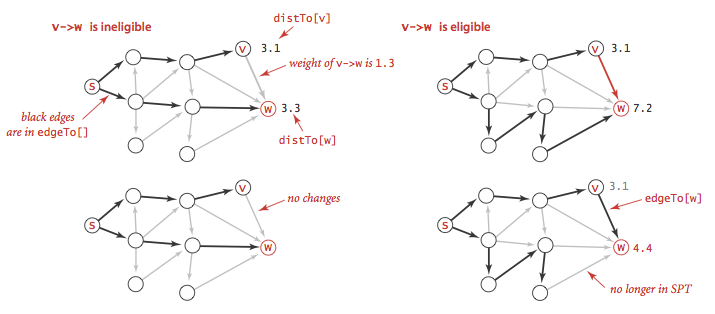
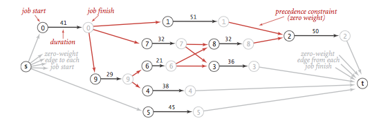

# 4.4 Shortest Paths

__Shortest paths.__ An edge-weighted digraph is a digraph where we associate weights or costs with each edge. A _shortest path_ from vertex s to vertex t is a directed path from s to t with the property that no other such path has a lower weight.


__Properties.__ We summarize several important properties and assumptions.

- _Paths are directed._ A shortest path must respect the direction of its edges.
- _The weights are not necessarily distances._ Geometric intuition can be helpful, but the edge weights weights might represent time or cost.
- _Not all vertices need be reachable._ If t is not reachable from s, there is no path at all, and therefore there is no shortest path from s to t.
- _Negative weights introduce complications._ For the moment, we assume that edge weights are positive (or zero).
- _Shortest paths are normally simple._ Our algorithms ignore zero-weight edges that form cycles, so that the shortest paths they find have no cycles.
- _Shortest paths are not necessarily unique._ There may be multiple paths of the lowest weight from one vertex to another; we are content to find any one of them.
- _Parallel edges and self-loops may be present._ In the text, we assume that parallel edges are not present and use the notation v->w to refer to the edge from v to w, but our code handles them without difficulty.

__Edge-weighted digraph data type.__ We represent the weighted edges using the following API:

```
class DirectedEdge:
    # initializes an edge from v to w of with a given weight
    def __init__(self, v, w, weight):
    
    # returns the weight of this edge
    def weight(self):

    # returns the vertex this edge points from
    def from_vertex(self):

    # returns the vertex this edge points to
    def to_vertex(self):
```

The __from_vertex()__ and __to_vertex()__ methods are useful for accessing the edge's vertices. [directed_edge.py](directed_edge.py) implements this API.

We represent edge-weighted digraphs using the following API:

```
class EdgeWeightedDigraph:
    # create an empty V-vertex EdgeWeightedDigraph
    def __init__(self, V):

    # returns number of vertices in this EdgeWeightedDigraph
    def V(self):

    # returns number of edges in this EdgeWeightedDigraph
    def E(self):

    # add DirectedEdge e to this EdgeWeightedDigraph
    def addEdge(self, edge):

    # returns edges pointing from vertex v in this EdgeWeightedDigraph
    def adj(self, v)

    # returns all edges in this EdgeWeightedDigraph
    def edges(self):
```

[edge_weighted_digraph.py](edge_weighted_digraph.py) implements the API using the adjacency-lists representation.


__Shortest paths API.__ We use the following API for computing the shortest paths of an edge-weighted digraph:

``` 
class SP:
    # initializes a shortest path given an EdgeWeightedDigraph G and a source vertex s
    def __init__(self, G, s):

    # returns shortest distance from s to v. Returns infinity if no path exists.
    def dist_to(self, v)

    # returns a boolean indicating if there exists a path from s to v
    def has_path_to(self, v):

    # returns the shortest path from s to v as a list of vertices. Returns null if there is no path
    def path_to(self, v):
```

__Data structures for single-source shortest paths__. Given an edge-weighted digraph and a designated vertex s, a _shortest-paths tree_ (SPT) is a subgraph containing s and all the vertices reachable from s that forms a directed tree rooted at s such that every tree path is a shortest path in the digraph.
We represent the shortest paths with two vertex-indexed arrays:

- _Edges on the shortest-paths tree_: __edgeTo[v]__ is the the last edge on a shortest path from s to v.
- _Distance to the source:_ __distTo[v]__ is the length of the shortest path from s to v.


__Relaxation.__ Our shortest-paths implementations are based on an operation known as _relaxation_. We initialize __distTo[s]__ to 0 and __distTo[v]__ to infinity for all other vertices v.
- _Edge relaxation._ To relax an edge __v->w__ means to test whether the best known way from s to w is to go from s to v, then take the edge from v to w, and, if so, update our data structures.

```
# helper function in SP to relax DirectedEdge e 
def _relax_edge(self , e):
    v = e.from_vertex()
    w = e.to_vertex()
    if distTo[w] > (distTo[v] + e.weight()):
        distTo[w] = distTo[v] + e.weight()
        edgeTo[w] = e
```



- _Vertex relaxation._ All of our implementations actually relax all the edges pointing from a given vertex.

```
# helper function in SP to relax vertex v in an EdgeWeightedDigraph G  
def _relax_vertex(G, v):
    for e in G.adj(v):
        w = e.to()
        if distTo[w] > (distTo[v] + e.weight()):
            distTo[w] = distTo[v] + e.weight()
            edgeTo[w] = e
```

__Dijkstra's algorithm.__ Dijkstra's algorithm initializing __dist[s]__ to 0 and all other __distTo[]__ entries to positive infinity. Then, it repeatedly relaxes and adds to the tree a non-tree vertex with the lowest __distTo[]__ value, continuing until all vertices are on the tree or no non-tree vertex has a finite __distTo[]__ value.

[dijkstra_sp.py](dijkstra_sp.py) is an efficient implementation of Dijkstra's algorithm.  It uses [index_min_pq.py](index_min_pq.py) for the priority queue.

__Proposition.__ Dijkstra's algorithm solves the single-source shortest-paths problem in edge-weighted digraphs with nonnegative weights using extra space proportional to V and time proportional to E log V (in the worst case).

__Acyclic edge-weighted digraphs.__ We use the term _edge-weighted DAG_ to refer to an acyclic edge-weighted digraph.

- _Single-source shortest paths problem in edge-weighted DAGs._ We now consider an algorithm for finding shortest paths that is simpler and faster than Dijkstra's algorithm for edge-weighted DAGs.
    - It solves the single-source problem in linear time.
    - It handles negative edge weights.
    - It solves related problems, such as finding longest paths.
The algorithm combines vertex relaxation with topological sorting. We initialize __distTo[s]__ to 0 and all other __distTo[]__ values to infinity, then relax the vertices, one by one, taking the vertices in topological order. 
- _Single-source longest paths problem in edge-weighted DAGs._ We can solve the single-source longest paths problems in edge-weighted DAGs by initializing the distTo[] values to negative infinity and switching the sense of the inequality in relax(). 
- _Critical path method._ We consider the parallel precedence-constrained job scheduling problem: Given a set of jobs of specified duration to be completed, with precedence constraints that specify that certain jobs have to be completed before certain other jobs are begun, how can we schedule the jobs on identical processors (as many as needed) such that they are all completed in the minimum amount of time while still respecting the constraints


This problem can be3 solved by formulating it as a longest paths problem in an edge-weighted DAG: Create an edge-weighted DAG with a source s, a sink t, and two vertices for each job (a start vertex and an end vertex). For each job, add an edge from its start vertex to its end vertex with weight equal to its duration. For each precedence constraint v->w, add a zero-weight edge from the end vertex corresponding to v to the beginning vertex corresponding to w. Also add zero-weight edges from the source to each job's start vertex and from each job's end vertex to the sink.



Now, schedule each job at the time given by the length of its longest path from the source.


__Proposition.__ By relaxing vertices in topological order, we can solve the single-source shortest-paths and longest-paths problems for edge-weighted DAGs in time proportional to E + V.

__Shortest paths in general edge-weighted digraphs.__ We can solve shortest path problems if (i) all weights are nonnegative or (ii) there are no cycles.

- _Negative cycles._ A negative cycle is a directed cycle whose total weight (sum of the weights of its edges) is negative. The concept of a shortest path is meaningless if there is a negative cycle. 

 

Accordingly, we consider edge-weighted digraphs with no negative cycles.

- Bellman-Ford algorithm. Initialize __distTo[s]__ to 0 and all other __distTo[]__ values to infinity. Then, considering the digraph's edges in any order, and relax all edges. Make V such passes. We do not consider this version in detail because it always relaxes V E edges.
```
for pass in range(0, G.V()):
    for v in range(O, len(G.V())):
        for e in G.adj(v):
            self._relax(e)
```


__Proposition.__ There exists a shortest path from s to v in an edge-weighted digraph if and only if there exists at least one directed path from s to v and no vertex on any directed path from s to v is on a negative cycle.

__Proposition.__ The Bellman-Ford algorithm solves the single-source shortest-paths problem from a given source s (or finds a negative cycle reachable from s) for any edge-weighted digraph with V vertices and E edges, in time proportional to E V and extra space proportional to V, in the worst case.

# Review Exercises 
1. True or false. Adding a constant to every edge weight does not change the solution to the single-source shortest-paths problem.
2. Suppose that we convert an `EdgeWeightedGraph` into an `EdgeWeightedDigraph` by creating two `DirectedEdge` objects in the `EdgeWeightedDigraph` (one in each direction) for each Edge in the `EdgeWeightedGraph` and then use the Bellman-Ford algorithm. Explain why this approach fails spectacularly.
3. What happens if you allow a vertex to be enqueued more than once in the same pass in the Bellman-Ford algorithm?
4. __Monotonic shortest path.__ Given an edge-weighted digraph, find a monotonic shortest path from s to every other vertex. A path is monotonic if the weight of every edge on the path is either strictly increasing or strictly decreasing.
5. __Optimal substructure property.__ Prove that every subpath on a shortest path from v to w is also a shortest path between the two endpoints.
6. __Unique shortest path tree.__ Suppose that there is a unique shortest path from s to every other vertex. Prove that the SPT is unique. 
