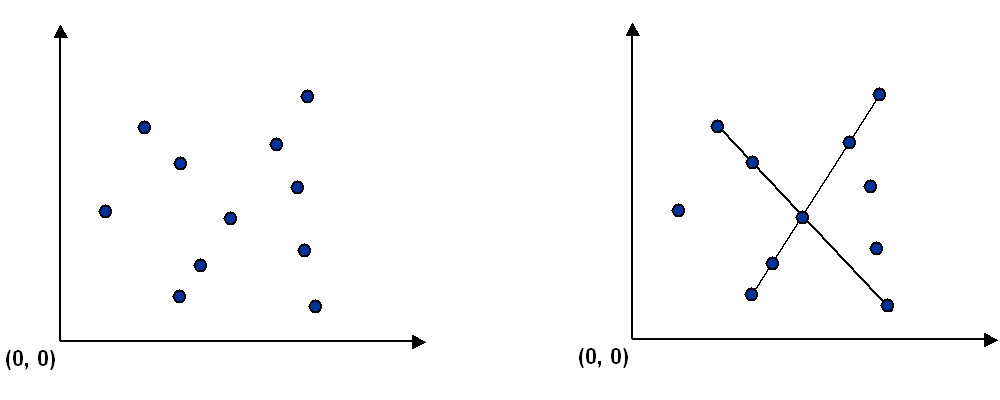
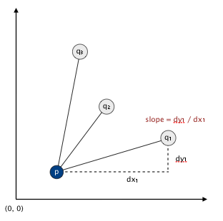

# Collinear

## Description
Write a program to recognize line patterns in a given set of points.

Computer vision involves analyzing patterns in visual images and reconstructing the real-world objects that produced them. The process in often broken up into two phases: feature detection and pattern recognition. Feature detection involves selecting important features of the image; pattern recognition involves discovering patterns in the features. We will investigate a particularly clean pattern recognition problem involving points and line segments. This kind of pattern recognition arises in many other applications such as statistical data analysis.

__The problem.__ Given a set of `N` distinct points in the plane, draw every (maximal) line segment that connects a subset of M or more of the points.




## Part 1 - Point Data Type

Point data type. Create an immutable data type Point that represents a point in the plane by implementing the following API:

```
class Point:
    def __init__(self, x, y):

    # returns the x-value of this point
    def x(self):

    # returns the y-value of this point
    def y(self):

    # returns a string representation of this point
    def __str__(self):
    
    # compare two points by y-coordinates, breaking ties by x-coordinates. Used by pythons built in sort() function
    def __lt__(self, that_point):

    # returns the slope between this point and that point
    def slopeTo(self, that_point):
```

Your job is to add the following components.

- The `__str__` method should return a string representation of this point. It is only used by you for debugging.
- The `__lt__`  method should compare points by their y-coordinates, breaking ties by their x-coordinates. Formally, the invoking point (x0, y0) is less than the argument point (x1, y1) if and only if either y0 < y1 or if y0 = y1 and x0 < x1. This method is used by pythons built in sort() function and overrides the '<' operator.
- The `slopeTo()` method should return the slope between the invoking point (x0, y0) and the argument point (x1, y1), which is given by the formula (y1 − y0) / (x1 − x0). Treat the slope of a horizontal line segment as positive zero; treat the slope of a vertical line segment as positive infinity; treat the slope of a degenerate line segment (between a point and itself) as negative infinity.


##Brute force pattern recognition.

Write a program [brute_collinear.py](brute_collinear.py) that examines 4 points at a time and checks whether they all lie on the same line segment. Your program should implement the following API:

```
class BruteCollinearPoints:

    # makes a defensive copy of the list of points and initializes and saves it.
    def __init__(self, points):

    # returns the number of total points 
    def numberOfPoints(self):

    # returns an iterable of segments of length 4
    def segments(self):
```

- The `segments`  - The method segments() should include each line segment containing 4 points. For simplicity, we will not supply any input to BruteCollinearPoints that has 5 or more collinear points.

To check whether the 4 points p, q, r, and s are collinear, check whether the slopes between p and q, between p and r, and between p and s are all equal. 

The order of growth of the running time of your methods should be no worse than `N^4` in the worst case and your methods should use space proportional to the number of segments of length 4.

## A faster, sorting-based solution. 

Remarkably, it is possible to solve the problem much faster than the brute-force solution described above. Given a point _p_, the following method determines whether _p_ participates in a set of _M_ or more collinear points.

- Think of _p_ as the origin.
- For each other point _q_, determine the slope it makes with _p_.
- Sort the points according to the slopes they make with _p_.
- Check if any _M-1_ (or more) adjacent points in the sorted order have equal slopes with respect to _p_. If so, these points, together with _p_, are collinear.

Applying this method for each of the _N_ points in turn yields an efficient algorithm to the problem. The algorithm solves the problem because points that have equal slopes with respect to _p_ are collinear, and sorting brings such points together. The algorithm is fast because the bottleneck operation is sorting.



Write a program [fast_collinear.py](fast_collinear.py) that implements this algorithm for an arbitrary number of points M > 2. The order of growth of the running time of your methods should be `N^2 log N` in the worst case and it should use space proportional to the number of collinear segments of length `min_length`.

The `segments(min_length)` method returns an iterable of all maximal length segments of length `min_length` or more. A maximal length segment is any segment that is not a subsegment of another segment, e.g. if `min_length` is 5, and `p→q→r→s→t`, then `p→q→s→t` and `q→r→s→t` are subsegments and therefore are not maximal length segments.

```
class FastCollinearPoints:
    # makes a defensive copy of the list of points and initializes and saves it.
    def __init__(self):

    # returns the number of total points 
    def numberOfPoints(self):

    # returns an iterable of segments of length min_length or more
    def segments(self, min_length = 4):
```

## Testing
To check your code simply run 

```
python test_brute_collinear.py
python test_fast_collinear.py
```

The output in stddraw from brute collinear test should display

 

and the output in stddraw from fast collinear test should display 


