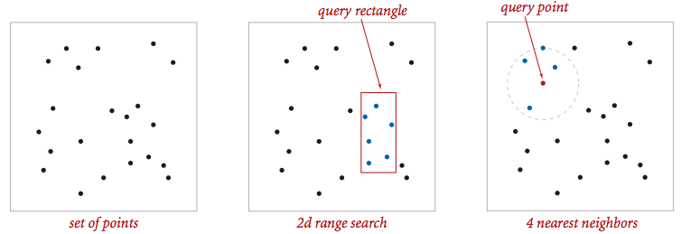
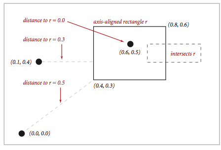
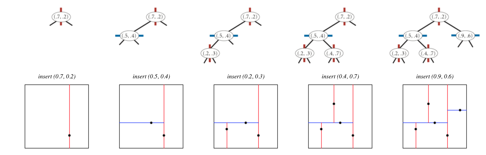

# Kd-Trees

Write a data type to represent a set of points in the unit square (all points have x- and y-coordinates between 0 and 1) using a 2d-tree to support efficient range search (find all of the points contained in a query rectangle) and nearest neighbor search (find a closest point to a query point). 2d-trees have numerous applications, ranging from classifying astronomical objects to computer animation to speeding up neural networks to mining data to image retrieval.



__Geometric primitives.__ To get started, use the following geometric primitives for points and axis-aligned rectangles in the plane.



Write an immutable data type `Point` for points in the plane. Here is the API that you will need to implement.

```
class Point:
    def __init__(self, x, y): # Construct the point (x,y); x,y are floats
    def x(self): # Returns x-coordinate
    def y(self): # Returns y-coordinate
    def distanceSquaredTo(self, that_point): # Returns square of Euclidean distance to that_point as a float. that_point is Point. 
    def __cmp__(self, that_point): # Comparable method for sorting points by x-coordinate first then y-coordinate. that_point is a Point.
    def equals(self, that_point): # Is that_point the same as this point?
    def draw(self): # Draws this point in standard draw
    def __str__(self): # Returns string representation of this point - (x,y)
```

Then you will write an immutable data type `Rectangle` which depends on `Point`. Here is the API that you will need to implement.

```
class Rectangle:
    def __init__(self, xmin, ymin, xmax, ymax): # Constructs rectanble given the corners. Throw an exception if xmin > xmax or ymin > ymax.
    def xmin(self): # Returns min x-coordinate
    def ymin(self): # Returns min y-coordinate
    def xmax(self): # Returns max x-coordinate
    def ymax(self): # Returns max y-coordinate
    def contains(self, p): # Does this rectangle contain p (either inside or on the boundary)? p is a point.
    def intersects(self, that_rectangle): # Does this rectangle intersect that_rectangle at any point?
    def distanceSquaredTo(self, p): # Square of Euclidean distance from point p to the closest point in this rectangle. 
    def equals(self, that_rectangle): # Does this rectangle equal that_rectangle?
    def draw(self): # Draws this rectangle in standard draw
    def __str__(self): # Returns string representation of rectangle.
```

__Brute-force implementation.__ Write a mutable data type [PointSet] that represents a set of points in the unit square ([0,1] X [0,1]). Implement the following API by using a [red-black BST](https://github.com/darekj28/big-four-tech/blob/master/2_algorithms/3_searching/3_balanced_search_trees/red_black_bst.py) 
```
class PointSet:
    def __init__(self): # Construct an empty set of points
    def isEmpty(self): # Is the set empty?
    def size(self): # returns number of points in the set
    def insert(self, p): # Add the point p to the set (if it is not already in the set)
    def contains(self, p): # Does the set contain the point p?
    def draw(self): # Draw all the points to standard draw 
    def nearest(self, p): # Returns the nearest neighbor in the set to p; return None if the set is empty.
```

Your implementation should support `insert()` and `contains()` in time proportional to the logarithm of the number of points in the set in the worst case; it should support `nearest()` and `range()` in time proportional to the number of points in the set.

__2d-tree implementation.__ Write a mutable data type `KdTree` that uses a 2d-tree to implement the same API (but replace `PointSET` with `KdTree`). A 2d-tree is a generalization of a BST to two-dimensional keys. The idea is to build a BST with points in the nodes, using the x- and y-coordinates of the points as keys in strictly alternating sequence, starting with the x-coordinates.

- __Search and insert.__ The algorithms for search and insert are similar to those for BSTs, but at the root we use the x-coordinate (if the point to be inserted has a smaller x-coordinate than the point at the root, go left; otherwise go right); then at the next level, we use the y-coordinate (if the point to be inserted has a smaller y-coordinate than the point in the node, go left; otherwise go right); then at the next level the x-coordinate, and so forth.



- __Draw.__ A 2d-tree divides the unit square in a simple way: all the points to the left of the root go in the left subtree; all those to the right go in the right subtree; and so forth, recursively. Your `draw()` method should draw all of the points to standard draw in black and the subdivisions in red (for vertical splits) and blue (for horizontal splits). This method need not be efficient—it is primarily for debugging.

The prime advantage of a 2d-tree over a BST is that it supports efficient implementation of range search and nearest neighbor search. Each node corresponds to an axis-aligned rectangle in the unit square, which encloses all of the points in its subtree. The root corresponds to the unit square; the left and right children of the root corresponds to the two rectangles split by the x-coordinate of the point at the root; and so forth.

- __Range search.__ To find all points contained in a given query rectangle, start at the root and recursively search for points in _both_ subtrees using the following _pruning rule_: if the query rectangle does not intersect the rectangle corresponding to a node, there is no need to explore that node (or its subtrees). A subtree is searched only if it might contain a point contained in the query rectangle.
- __Nearest neighbor search.__ To find a closest point to a given query point, start at the root and recursively search in _both_ subtrees using the following _pruning rule_: if the closest point discovered so far is closer than the distance between the query point and the rectangle corresponding to a node, there is no need to explore that node (or its subtrees). That is, a node is searched only if it might contain a point that is closer than the best one found so far. The effectiveness of the pruning rule depends on quickly finding a nearby point. To do this, organize your recursive method so that when there are two possible subtrees to go down, you choose first _the subtree that is on the same side of the splitting line as the query point_; the closest point found while exploring the first subtree may enable pruning of the second subtree.

__Clients.__  You may use the following interactive client programs to test and debug your code. To run these you will need to use some of the [standard libraries found here](https://github.com/darekj28/big-four-tech/tree/master/1_learn_python)

- [kd_tree_visualizer.py](kd_tree_visualizer.py) computes and draws the 2d-tree that results from the sequence of points clicked by the user in the standard drawing window.
- [range_search_visualizer.py](range_search_visualizer.py) reads a sequence of points from a file (specified as a command-line argument) and inserts those points into a 2d-tree. Then, it performs range searches on the axis-aligned rectangles dragged by the user in the standard drawing window.
- [nearest_neighbor_visualizer.py](nearest_neighbor_visualizer.py) reads a sequence of points from a file (specified as a command-line argument) and inserts those points into a 2d-tree. Then, it performs nearest neighbor queries on the point corresponding to the location of the mouse in the standard drawing window.

__Analysis of running time and memory usage.__ Analyze the effectiveness of your approach to this problem by giving estimates of its time and space requirements.

- Give the total memory usage in bytes (using tilde notation) of your 2d-tree data structure as a function of the number of points N, using the memory-cost model from lecture and Section 1.4 of the textbook. Count all memory that is used by your 2d-tree, including memory for the nodes, points, and rectangles. For the purposes of this assignment, assume that each Point2D object uses 32 bytes.
- Give the expected running time in seconds (using tilde notation) to build a 2d-tree on N uniformly random points in the unit square. (Do not count the time to read in or generate the points.) Using the given input files is not sufficient.
- How many nearest neighbor calculations can your 2d-tree implementation perform per second for [input100K.txt](files/input100K.txt) (100,000 points) and [input1M.txt](files/input1M.txt) (1 million points), where the query points are uniformly random points in the unit square? (Do not count the time to read in the points or to build the 2d-tree.) Repeat this question but with the brute-force implementation.

__Submission.__  Submit `point.py`, `rectangle.py`, `point_set.py`, and `kdtree.py` for `Point`, `Rectangle`, `PointSet`, and `KdTree` respectively. Each data type should include their own `main()`` that thoroughly tests the associated operations. 