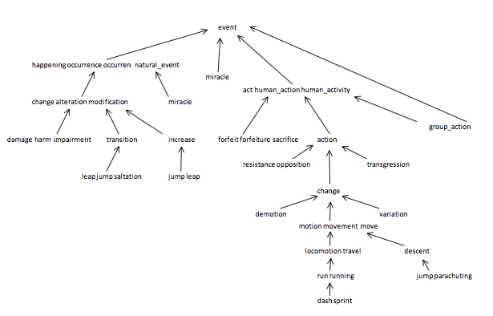

# 8. WordNet

[WordNet](https:#wordnet.princeton.edu/) is a semantic lexicon for the English language that is used extensively by computational linguists and cognitive scientists; for example, it was a key component in IBM's [Watson](https:#en.wikipedia.org/wiki/Watson_(computer)). WordNet groups words into sets of synonyms called synsets and describes semantic relationships between them. One such relationship is the is-a relationship, which connects a _hyponym_ (more specific synset) to a _hypernym_ (more general synset). For example, a plant organ is a hypernym of carrot and plant organ is a hypernym of plant root.

__The WordNet digraph.__ Your first task is to build the wordnet digraph: each vertex _v_ is an integer that represents a synset, and each directed edge _v_ → _w_ represents that _w_ is a hypernym of _v_. The wordnet digraph is a rooted DAG: it is acylic and has one vertex that is an ancestor of every other vertex. However, it is not necessarily a tree because a synset can have more than one hypernym. A small subgraph of the wordnet digraph is illustrated below.



__The WordNet input file formats.__ We now describe the two data files that you will use to create the wordnet digraph. The files are in CSV format: each line contains a sequence of fields, separated by commas.

- _List of noun synsets._ The file `synsets.txt` lists all the (noun) synsets in WordNet. The first field is the synset id (an integer), the second field is the synonym set (or synset), and the third field is its dictionary definition (or gloss). For example, the line
    `36,AND_circuit AND_gate,a circuit in a computer that fires only when all of its inputs fire`

    means that the synset { AND_circuit, AND_gate } has an id number of 36 and it's gloss is a circuit in a computer that fires only when all of its inputs fire. The individual nouns that comprise a synset are separated by spaces (and a synset element is not permitted to contain a space). The S synset ids are numbered 0 through _S_ − 1; the id numbers will appear consecutively in the synset file.
- _List of hypernyms._ The file `hypernyms.txt` contains the hypernym relationships: The first field is a synset id; subsequent fields are the id numbers of the synset's hypernyms. For example, the following line

    ```
    164,21012,56099
    ```

    means that the the synset `164 ("Actifed")` has two hypernyms: `21012 ("antihistamine")` and `56099 ("nasal_decongestant")`, representing that Actifed is both an antihistamine and a nasal decongestant. The synsets are obtained from the corresponding lines in the file `synsets.txt`.

    ```
    164,Actifed,trade name for a drug containing an antihistamine and a decongestant...
    21012,antihistamine,a medicine used to treat allergies...
    56099,nasal_decongestant,a decongestant that provides temporary relief of nasal...
    ```

__WordNet data type.__ Implement an immutable data type WordNet with the following API in a file called `wordnet.py`:

```
class Wordnet:
    # constructor takes the name of the two input files
    def __init__(self, synsets, hypernyms)

    # returns all WordNet nouns as a list of strings.
    def nouns(self)

    # is the word a WordNet noun?
    def isNoun(self, word)

    # distance between nounA and nounB (defined below)
    def distance(self, nounA, nounB)

    # a synset (second field of synsets.txt) that is the common ancestor of nounA and nounB
    # in a shortest ancestral path (defined below)
    def sap(self, nounA, nounB)
```

The constructor should throw an execption if the input does not correspond to a rooted DAG. Feel free to use [digraph_edge_list.py](digraph_edge_list.py) as well as [kosaraju_sharir_scc.py](kosaraju_sharir_scc.py) to confirm that the input is a DAG. The `distance()` and `sap()` methods should throw a exceptions unless both of the noun arguments are WordNet nouns.

Your data type should use space linear in the input size (size of synsets and hypernyms files). The constructor should take time linearithmic (or better) in the input size. The method `isNoun()` should run in time logarithmic (or better) in the number of nouns. The methods `distance()` and `sap()` should run in time linear in the size of the WordNet digraph.

__Shortest ancestral path.__ An ancestral path between two vertices _v_ and _w_ in a digraph is a directed path from _v_ to a common ancestor _x_, together with a directed path from _w_ to the same ancestor _x_. A _shortest ancestral path_ is an ancestral path of minimum total length. For example, in the digraph at left ([digraph1.txt](digraph1.txt)), the shortest ancestral path between 3 and 11 has length 4 (with common ancestor 1). In the digraph at right ([digraph2.txt](digraph2.txt)), one ancestral path between 1 and 5 has length 4 (with common ancestor 5), but the shortest ancestral path has length 2 (with common ancestor 0).


__SAP data type.__ Implement an immutable data type `SAP` with the following API in a file called `sap.py`:

```
class SAP:
    # constructor takes a digraph (not necessarily a DAG)
    def __init__(self, G)

    # length of shortest ancestral path between v and w; -1 if no such path
    def length(self, v, w)

    # a common ancestor of v and w that participates in a shortest ancestral path; -1 if no such path. v and w are vertices.
    def ancestor(self, v,  w)

    # length of shortest ancestral path between any vertex in v and any vertex in w; -1 if no such path. v_list, w_list are lists of vertices.
    def length(self, v_list, w_list)

    # a common ancestor that participates in shortest ancestral path; -1 if no such path. v_list, w_list are lists of vertices.
    def ancestor_list(self, v_list, w_list)
```

All methods should throw an exception if one (or more) of the input arguments is not between `0` and `G.V() - 1`. You may assume that the iterable arguments contain at least one integer. All methods (and the constructor) should take time at most proportional to _E_ + _V_ in the worst case, where _E_ and _V_ are the number of edges and vertices in the digraph, respectively. Your data type should use space proportional to _E_ + _V_.


__Test client.__ Your `main()` for `SAP` should take the name of a digraph input file as as a command-line argument, construct the digraph, and use that digraph to test that all SAP methods work as expected. The following test client reads in vertex pairs from standard input, and prints out the length of the shortest ancestral path between the two vertices and a common ancestor that participates in that path: On the left below you can see the contents of `digraph1.txt` and on the right are a few samples of expected values if your program reads in that input file:

    ```
    % more digraph1.txt             python3 sap.py digraph1.txt 3 11
    13                              v = 3, w = 11
    11                              length = 4, ancestor = 1
     7  3                            
     8  3                           v = 9, w = 12
     3  1                           length = 3, ancestor = 5
     4  1
     5  1                           v = 1, w = 6
     9  5                           length = -1, ancestor = -1
    10  5
    11 10                           
    12 10                           
     1  0
     2  0
    ```

For testing WordNet one can try the following. The main method should take 4 arguments, the synsets, hypersnyms, nounA, and nounB then output the distance between then and the ancestor along that path.

```
# Template
% python3 wordnet.py files/synsets.txt files/hypernyms.txt [nounA] [nounB]

# Example.
% python3 wordnet.py files/synsets.txt files/hypernyms.txt demotion descent
(3) demotion, descent
(change) descent, demotion

% python3 wordnet.py files/synsets.txt files/hypernyms.txt transition descent
(4) transition, descent
(change) transition, descent

% python3 wordnet.py files/synsets.txt files/hypernyms.txt dash leap
(8) dash, leap
(act deed human_action human_activity) dash, leap
```

__Measuring the semantic relatedness of two nouns.__ Semantic relatedness refers to the degree to which two concepts are related. Measuring semantic relatedness is a challenging problem. For example, most of us agree that _George Bush_ and _John Kennedy_ (two U.S. presidents) are more related than are _George Bush_ and _chimpanzee_ (two primates). However, not most of us agree that _George Bush_ and _Eric Arthur Blair_ are related concepts. But if one is aware that _George Bush_ and _Eric Arthur Blair_ (aka George Orwell) are both communicators, then it becomes clear that the two concepts might be related.

We define the semantic relatedness of two wordnet nouns _A_ and _B_ as follows:

- _distance(A, B)_ = distance is the minimum length of any ancestral path between any synset _v_ of A and any synset _w_ of B.

This is the notion of distance that you will use to implement the `distance()` and `sap()` methods in the `WordNet` data type.

__Outcast detection.__ Given a list of wordnet nouns A<sub>1</sub>, A<sub>2</sub>, ..., A<sub>n</sub>, which noun is the least related to the others? To identify an outcast, compute the sum of the distances between each noun and every other one:

```
d_i = dist(A_i, A_1)   +   dist(A_i, A_2)   +   ...   +   dist(A_i, A_n)
```

and return a noun A<sub>t</sub> for which d<sub>t</sub> is maximum.

Implement an immutable data type `Outcast` with the following API in a file called `outcast.py`:

```
class Outcast:
    # constructor takes a WordNet object
    def __init__(self, wordnet):

    # given an array of WordNet nouns, return an outcast as a string. 
    def outcast(self, nouns):
```

Assume that argument array to the `outcast()` method contains only valid wordnet nouns (and that it contains at least two such nouns).

The following test client takes from the command line the name of a synset file, the name of a hypernym file, followed by the names of outcast files, and prints out an outcast in each file:

```
if __name__ == "__main__":
    wordnet = WordNet(sys.argv[1], sys.argv[2])
    outcast = Outcast(wordnet)
    for t in range(3, len(sys.argv)):
        nouns = InStream.readStrings(args[t])
        print(args[t] + ": " + outcast.outcast(nouns))
```
Here is a sample execution:
```
% more outcast5.txt
horse zebra cat bear table

% more outcast8.txt
water soda bed orange_juice milk apple_juice tea coffee

% more outcast11.txt
apple pear peach banana lime lemon blueberry strawberry mango watermelon potato


% python outcast.py synsets.txt hypernyms.txt outcast5.txt outcast8.txt outcast11.txt
outcast5.txt: table
outcast8.txt: bed
outcast11.txt: potato
```

__Analysis of running time.__ Analyze the effectiveness of your approach to this problem by giving estimates of its time requirements.

- Give the order of growth of the worst-case running time of the length() and ancestor() methods in SAP as a function of the number of vertices V and the number of edges E in the digraph.
- Give the order of growth of the best-case running time of the same methods.

__Testing Files.__ All files used exist in the [files](files) directory.

__Additional Libraries.__ You will want to use [digraph.py](digraph.py), [kosaraju_sharir_scc.py](kosaraju_sharir_scc.py), [directed_bfs_paths.py](directed_bfs_paths.py)and [instream.py](instream.py).

__Deliverables.__ Complete `wordnet.py`, `sap.py`, and `outcast.py` that implement the APIs described above.